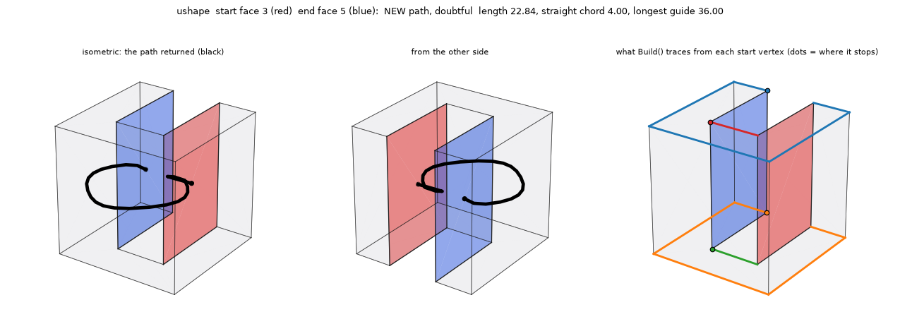
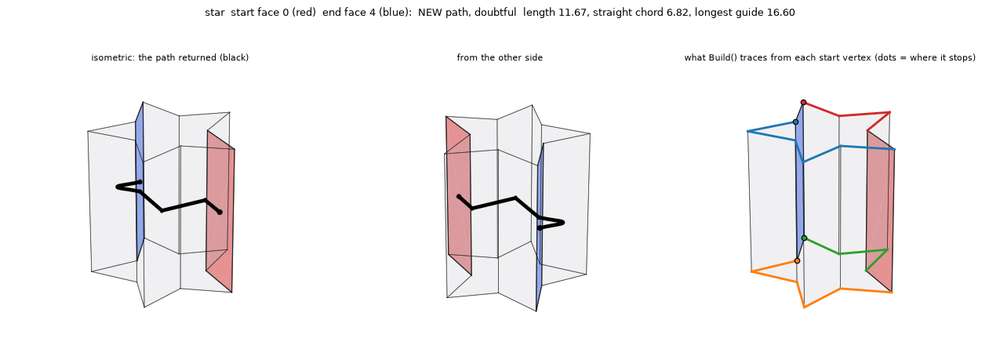

# #3105 review, round 2: the algorithm now computes, and what it computes

This directory was regenerated for the second review. The user's answers to round 1 (their words):

1. G1: "every single one of those paths computed by Build() looks valid and should be computed. The path is lying along the edges of the shape from vertex following the edges from input shape to output shape, this looks valid to me."
2. G2: "Again the path that Build traces follows the shortest route along the edges of the solid from input vertices to output vertices, this looks valid."
3. G3: "This one is hard to see because of the orientation and appears to be a tetrahedron not an octahedron: check and reorientate."
4. ushape 2/6: "yes that looks valid, centroid to centroid. what about the other shapes on the contact sheets?"
5. Scope: "Extend the patch" to the pairs that share a vertex.

## What changed

Patch 0058 no longer refuses G1 and G2. Where `Build()` cast a path that had already reached a vertex to an edge, it now carries the vertex forward, which is what its first pad already does. In full (the writeup is in `Scripts/patches/README.md`, the diff is 110 lines added, about 60 replaced):

- the pad appends the vertex again; a vertex end of a new section edge is read as the vertex's parameters on the face;
- a null face searches the connecting edge without the face condition; a null section edge is a refusal; a point with no tangent gets its flag set off in the interpolation;
- the insertion before level `i` refuses an element that is not an edge;
- the level loop stops after as many levels as the solid has edges.

**G3 first.** `octa` is a real octahedron: 6 vertices, 12 edges, 8 triangular faces (the probe builds it from eight sewn triangles; the Swift test asserts 8 faces). Viewed down its three-fold axis it reads as a star, so the new images use an oblique view and number the faces. Faces 0 and 6 are opposite triangles. The three paths from the start triangle are one edge long, two of them end on the same vertex of the opposite triangle and none reaches the third, so the end section is never reached. Nothing is computed there.

## Results over all 573 pairs (16 solids, one process per pair)

| | abort | run on | throw | answers a path | answers not done |
|---|---|---|---|---|---|
| pinned kernel | 423 | 0 | 89 | 42 | 19 |
| with 0058 | 0 | 0 | 56 | 124 | 393 |

The 116 pairs that aborted, which share no vertex: **G1 91 -> 60 now answer a path, 31 refused. G2 21 -> 21 answer a path. G3 4 -> 4 refused.** That is 81 new paths. The 42 pairs that answered before answer exactly the same (edge count, length, centre of mass to six places). The 14 pairs that shared a vertex and still aborted in round 1 now answer not done or throw; none aborts or runs on.

### Every answered path was validated (`validate.py`, `validate-out.txt`)

| | G1 (60) | G2 (21) | as before (42) |
|---|---|---|---|
| valid wire (BRepCheck), connected | 60 | 21 | 42 |
| ends on the centroid of the start and end section, in the plane of each | 60 | 21 | 42 |
| no shorter than the chord, no longer than the longest traced guide | 60 | 20 | 42 |
| inside the solid (convex) or its bounding box | 56 | 14 | 42 |
| no self-crossing (paths in a plane) | 59 | 16 | 42 |
| the same on three runs | 60 | 21 | 42 |

14 new paths are marked doubtful: 3/5 0/4 1/4 2/4 0/4 0/5 0/6 1/3 3/5 3/6 3/7 4/6 4/7 5/7. They are valid wires with the right ends, and they loop, cross themselves, overshoot the solid or run longer than any guide.

## What the paths look like, solid by solid

Green = sensible, orange = doubtful in the contact sheets. Sensible means: valid, from centroid to centroid, within the bounds above, and no loop.

| solid | sheet | verdict |
|---|---|---|
| hex | `sheet-hex.png` | all 10 sensible: straight or two-segment path between the two face centroids, inside the prism. |
| lshape | `sheet-lshape.png` | 9 sensible (a V or L bend through the corner, inside the L); `3/5` doubtful, a loop 13.5 long on a chord of 5.6. |
| ushape | `sheet-ushape.png` | 11 sensible (the two as before, `0/2`, `0/3`, `1/4`, `1/5`, `1/6`, `1/7`, `2/4`, `2/5`, `2/7`), 10 doubtful: splines with loops or overshoot where the section centroids zigzag round the slot. |
| star | `sheet-star.png` | 33 valid, 30 of them plain zigzags through the centroids of a concave outline (the same character as the old results `0/5`, `1/6`, `2/7`, `3/8`, `4/9`), 3 doubtful (`0/4`, `1/4`, `2/4`) because the path leaves the bounding box. |
| oct8 | `sheet-oct8.png` | all 21 sensible: regular octagonal prism, the paths are short bent or straight lines inside it. |
| pent | `sheet-pent.png` | all 6 sensible, as before. |
| tri | `sheet-tri.png` | the 1 disjoint pair is a straight path, as before. |
| box | `sheet-box.png` | 3 opposite pairs, straight, as before. |
| cyl | `sheet-cyl.png` | the two caps, straight axis, as before. |
| frustum | `sheet-frustum.png` | the two caps, straight axis, as before. |
| bend | `sheet-bend.png` | 3 pairs, all as before and unchanged; straight lines between the face centroids of a bent tube. |
| capsule | `sheet-capsule.png` | nothing answers (one disjoint pair, refused by the kernel as before). |
| tube | `sheet-tube.png` | the two caps: straight axis, sensible (as before). Cap against bore: refused. |
| sqtube | `sheet-sqtube.png` | 5 as before (straight lines through the hole or the wall); the 24 outer-wall-against-hole-wall pairs are refused. |
| elbow | `sheet-elbow.png` | 3 pairs answer (`8/11` as before, `8/13` and `11/12` new, both sensible bent lines through the elbow); 8 refused for the level bound, the rest throw as before (the constructor's `UnifySameDomain` step). |
| octa | `sheet-octa.png` | all 4 refused: two of the three paths from the start triangle end on one vertex of the opposite triangle, so the end section is never reached. |

## Pictures

- Contact sheets, one per solid, every pair with no shared vertex, the path returned in black: `sheet-<solid>.png`.
- Detail images with three panels (path from two sides, then the guides `Build()` traces): `pair-<solid>-<i>-<j>.png`, one for each solid that answers, every doubtful pair, and the refusals (`octa 0/6`, `octa 1/7`, `tube 1/3`, `sqtube 0/6`, `elbow 8/13`).

## Where the patch refuses (all measured, `guards-final.txt`)

The end section is not reached within as many levels as the solid has edges: a tube cap against its bore (2), the outer wall of a cube with a square hole against a wall of the hole (24), the fused L-shaped bar (8), the opposite triangles of an octahedron (4); plus touching or same-face pairs the bridge refuses anyway. Smaller classes: no connecting edge and no common face (28), a vertex end not on the face (13, fused bar), a null 2d line (7), an insertion that meets a vertex (5).

## Questions that are still open

1. **The 14 doubtful paths** (`ushape` 10, `star` 3, `lshape` 1). They are valid and end at the centroids but loop or overshoot, because the final phase interpolates a spline through the section centroids with tangents taken from the guides. Keep them, refuse the ones that loop or leave the solid's bounding box, or change the interpolation to impose no tangents? (The last is a change to the final phase of `Build()`, outside this patch.)
2. **The zigzags** (`star`, concave sections): straight segments through the section centroids, 12 against a chord of 4 to 7. They are what the old results `star 0/5` and so on already look like. Accept?
3. **The refusals.** Tube cap against bore, outer wall against hole wall, antipodal octahedron triangles: there is a straight line between the centroids a person would draw, but no path along the edges reaches the end section. Refuse, or compute that line?
4. **The level bound** is the number of edges of the solid. The most any answered pair needed is a third of it. Acceptable as the rule, or would you rather a fixed multiple?
5. **`tri 0/0`** (the same face twice) answers a wire that has an edge with no curve; the bridge refuses it and the kernel is unchanged for it. `tri 1/1` (the same face, a closed ring) answers a valid closed path, as before. Leave both?
