# #3105 review: BRepOffsetAPI_MiddlePath pairs that crash, and what patch 0058 answers

Generated by `render.py` / `gen_index.py` in the parent directory. Every image is one solid with the
**start face in red** and the **end face in blue** (the two arguments of `Shape.middlePath(start:end:)`);
grey is the rest of the solid, seen through. Face numbers are the `TopExp_Explorer` order the probe uses
(`{solid} i / j`).

- **Left panel of a `pair-*.png`:** the input, nothing else.
- **Right panel:** what `Build()` traces. It starts one path per vertex of the start face (one colour per
  path, a dot where the path stops) and tries to march each along the solid's edges to the end face. A
  working pair shows its middle path in black instead.
- **`sheet-*.png`:** every pair of faces with no shared vertex for one solid, so you can see which pairs
  crash (red title, with the group) and which work (green title, the black line is the path returned).

Every one of the 116 crashing pairs below is a SIGSEGV on the pinned kernel
(`v4.0.0-kernel.5`) and is answered "no path" (nil) by the patched kernel. **Nothing here computes a new
path.** The question for you is whether that is right for each group.

## G1. A path stops short of the end face (91 pairs)

Faces that are not the two ends of a pipe: the paths from the start face's vertices do not all arrive at
the end face, so there is no "same walk" to build sections from. The kernel pads a short path once and then
casts the padding (a vertex) as an edge and reads garbage.

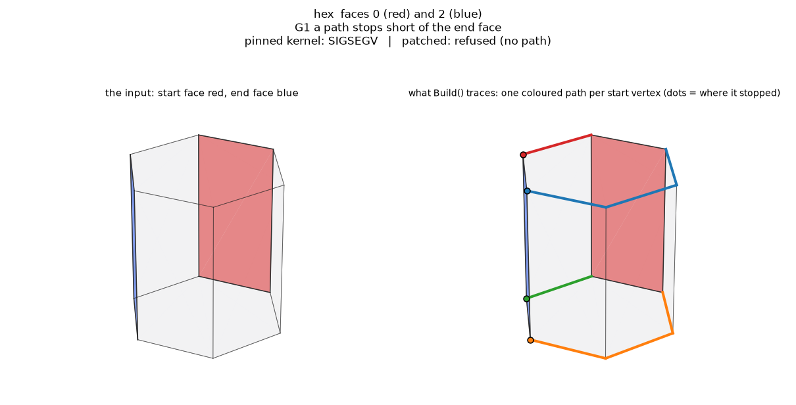

Hexagonal prism, side faces 0 and 2 (120 degrees apart, one face between them on one side). The two start
vertices on one side of the start face walk the ring one way, the two on the other side walk it the other
way. Compare the control, opposite faces 0 and 3, which work:

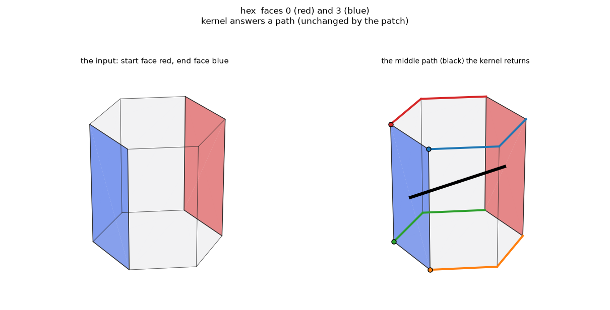

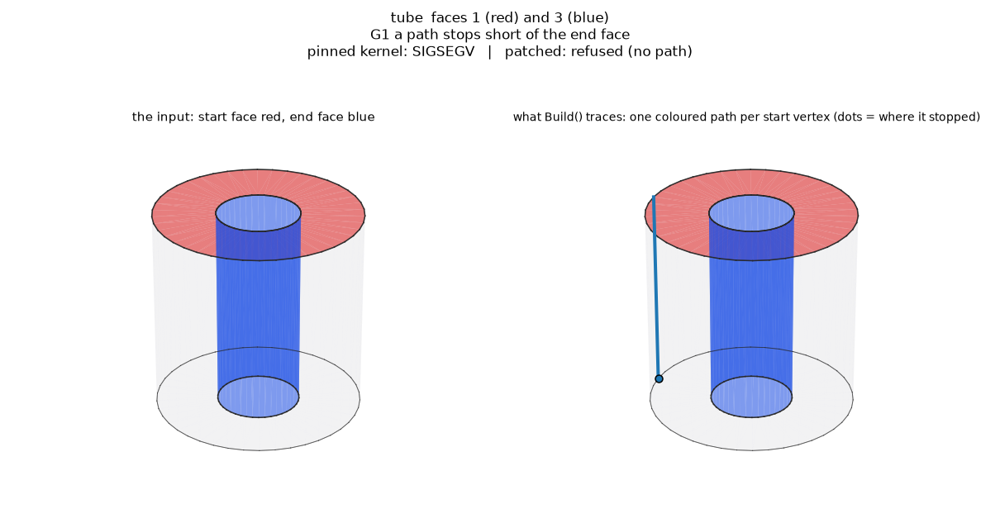

Tube, the top cap (red) against the bore (blue). The cap's one start vertex walks the seam down to the
bottom circle and has nowhere further to go; it never reaches the bore. Control, the two caps (work):

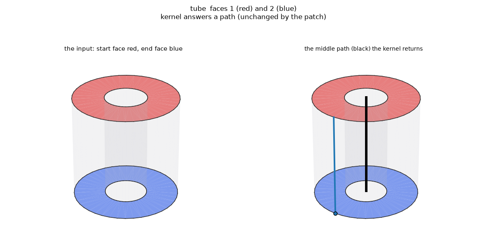

Pairs: **elbow** 4/6 4/7 4/8 4/11 8/10 8/13 11/12; **hex** 0/2 0/4 1/3 1/5 2/4 3/5; **lshape** 1/3 1/5; **oct8** 0/2 0/3 0/5 0/6 1/3 1/4 1/6 1/7 2/4 2/5 2/7 3/5 3/6 4/6 4/7 5/7; **sqtube** 0/6 0/7 0/8 0/9 1/6 1/7 1/8 1/9 2/6 2/7 2/8 2/9 3/6 3/7 3/8 3/9 4/6 4/7 4/8 4/9 5/6 5/7 5/8 5/9; **star** 0/2 0/3 0/4 0/6 0/7 0/8 1/3 1/4 1/5 1/7 1/8 1/9 2/4 2/5 2/6 2/8 2/9 3/5 3/6 3/7 3/9 4/6 4/7 4/8 5/7 5/8 5/9 6/8 6/9 7/9; **tube** 1/3 2/3; **ushape** 2/4 2/5 2/7 4/6

## G2. A path is a bare vertex with no edge before it (21 pairs)

L- and U-shaped prisms (concave outlines). A path runs into a corner where more than one edge could
continue and records a bare vertex there. To interpolate across that vertex the code reads the edge at the
previous level, which at the first level does not exist (or is itself a vertex).

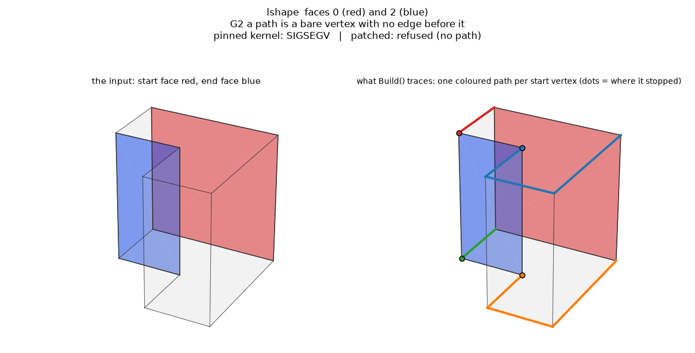

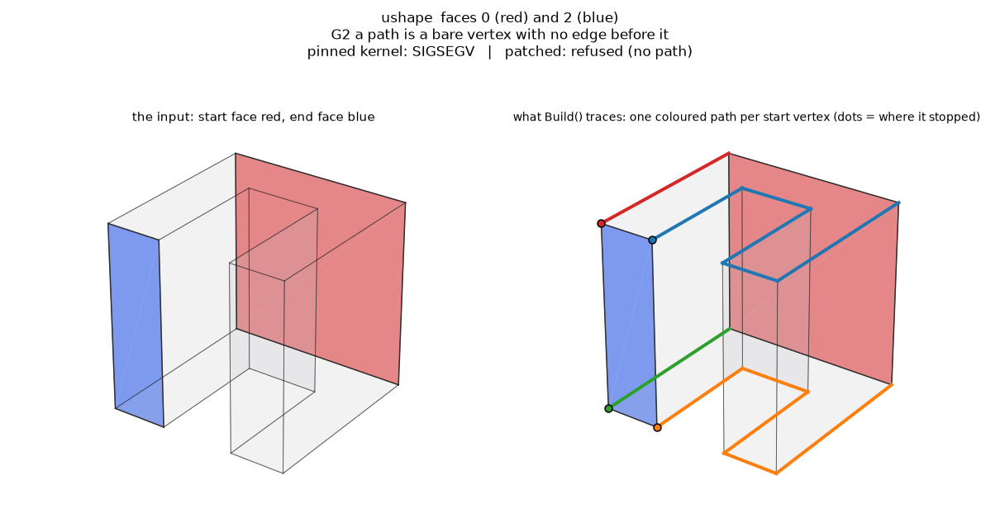

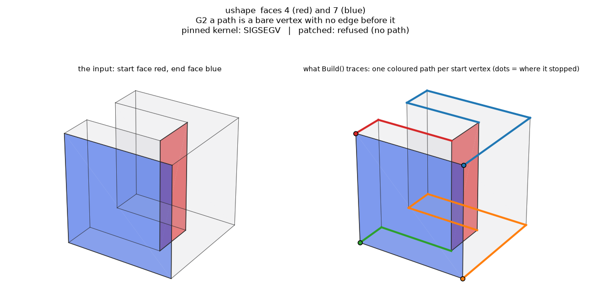

Pairs: **lshape** 0/2 0/3 0/4 2/4 2/5 3/5; **ushape** 0/2 0/3 0/4 0/5 0/6 1/3 1/4 1/5 1/6 1/7 3/5 3/6 3/7 4/7 5/7

## G3. No face holds both the path edge and the section edge (4 pairs)

Opposite triangles of an octahedron. Every path is a single edge that ends on a vertex of the other
triangle's side, and no face of the solid contains both that edge and the section edge it is to be joined
to, so the face the new edge is built on is null.

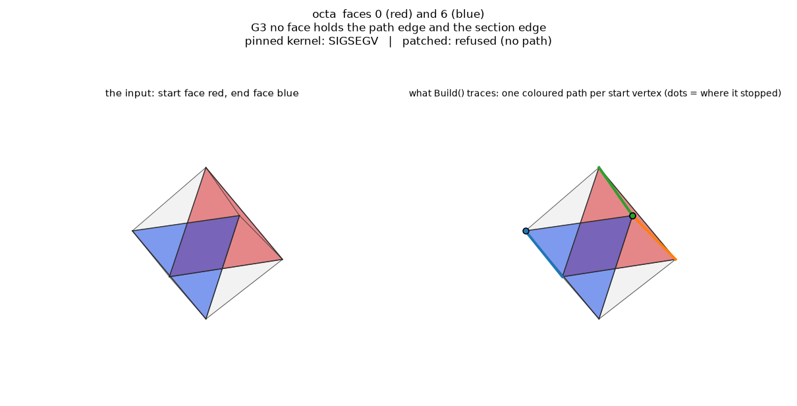

Pairs: **octa** 0/6 1/7 2/4 3/5

## Contact sheets (every pair with no shared vertex, per solid)

- 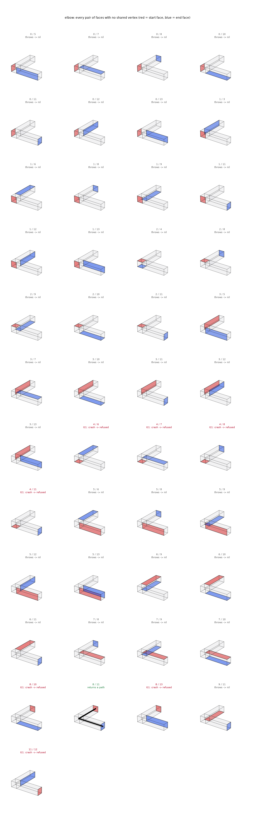
- 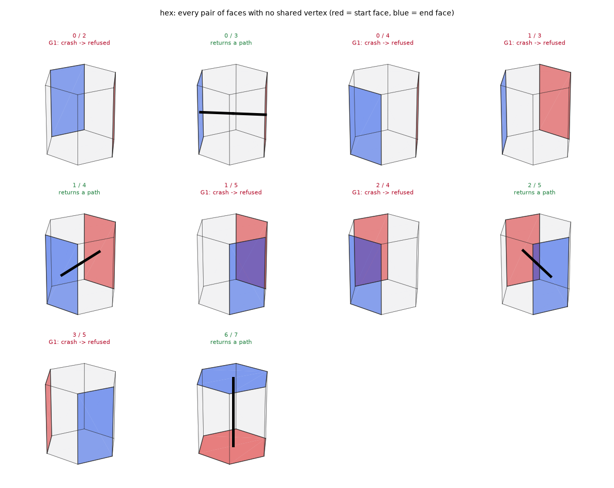
- 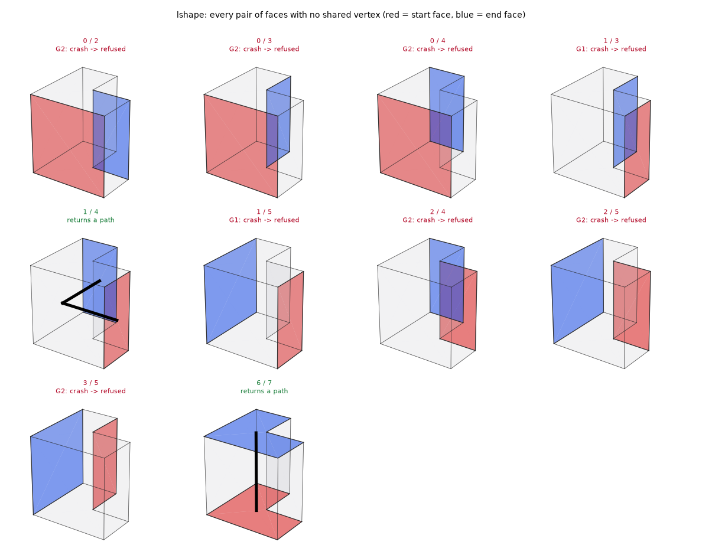
- 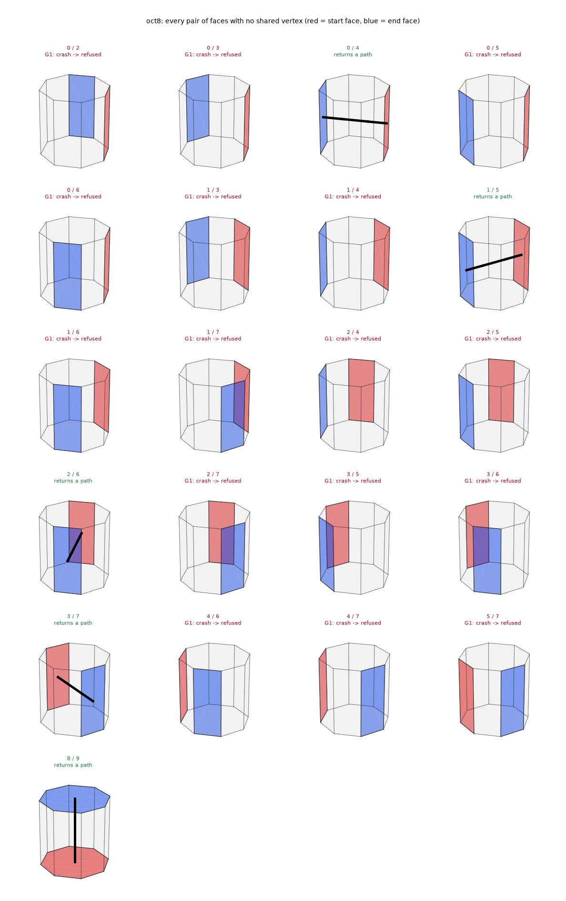
- 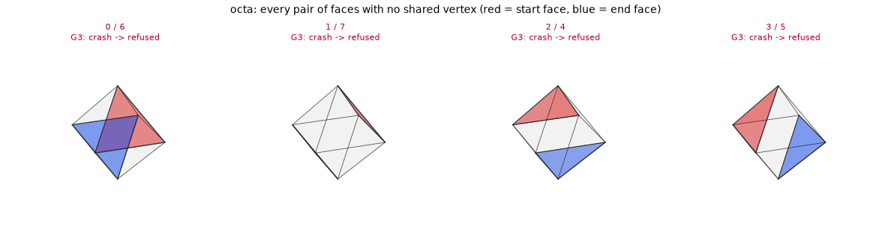
- 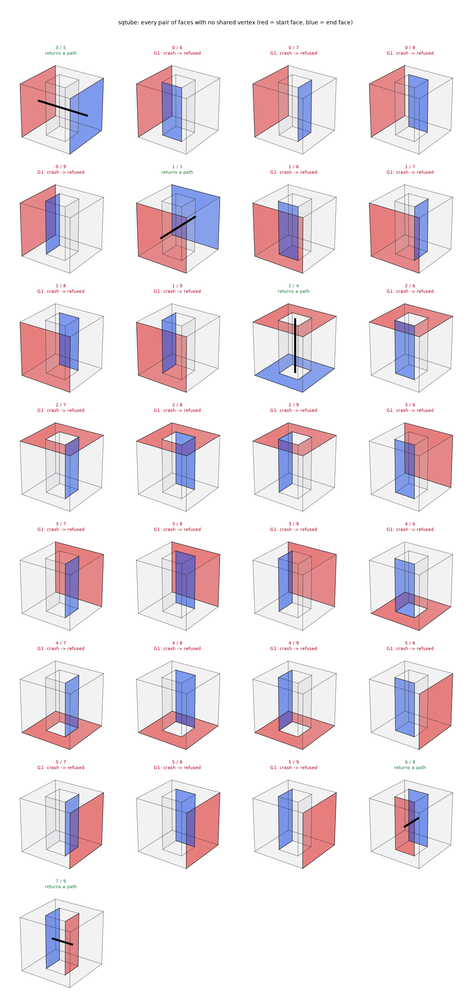
- 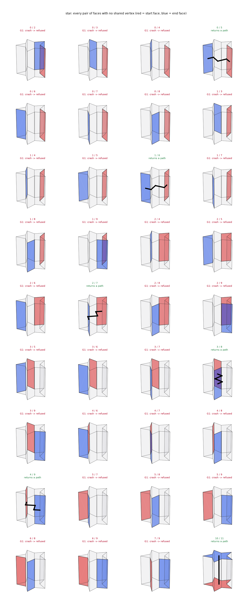
- 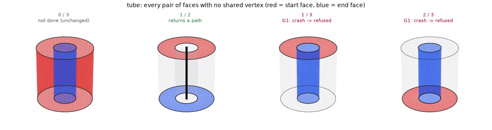
- 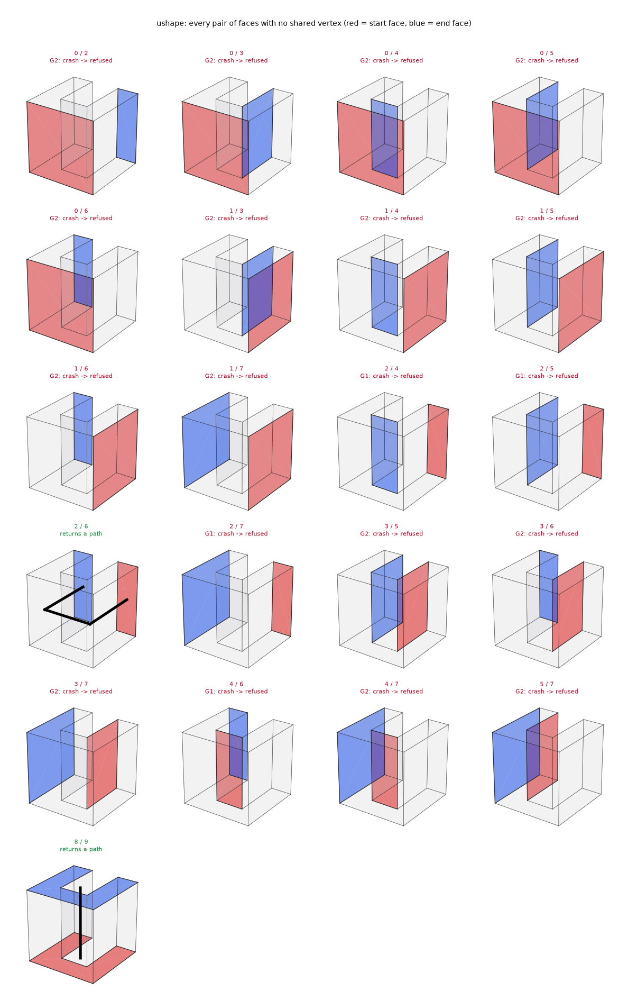

## Not changed by the patch

- **41 pairs return a path on both kernels, identical to six places** (edge count, length, centre of
  mass). They show as green titles on the sheets. One to look at with a critical eye, because the patch
  keeps it: `ushape 2/6`, two inner walls of the U's slot, returns a bent line that is hard to call a middle
  path.
- 37 pairs throw a catchable exception and 2 answer not done on both kernels; the bridge already answers nil.

## Questions for you

1. **G1, refuse or compute?** In the hexagonal prism (0/2) and the tube (cap against bore) there is no
   single sweep between the two faces, so the patch refuses. Do you agree none of the 91 pairs "obviously
   intends" a result?
2. **G2, L and U prisms.** The first-level vertex case is where a middle path might exist (the part is
   pipe-like around the corner). Refuse, as patched, or should `Build()` be taught the corner?
3. **G3, opposite octahedron triangles.** They are a twisted band, and a straight line between the
   centroids is a sensible answer a person would draw. Refuse, as patched?
4. **`ushape 2/6`**: is that returned line acceptable for a result the patch leaves alone?
5. **Scope.** The same family still aborts for 14 pairs that share a vertex with the start face (triangle
   and pentagon prisms, an elbow), at later lines the patch does not touch (a `BRepLib_MakeEdge` given a
   null 2D line, and one more read of a path); the Swift guard from #3098 refuses them. Extend the patch
   to those too, or leave them to the guard?
